<div align="center">
  
  
  # Piuma Vault

  ### A Personal Second-Brain, Agentic LLM Workspace & Private Media Vault
  
  *A highly secure, privacy-first, self-hosted digital workspace integrating rich notes, an AI agent with long-term memory, file hosting, tasks, and scheduling.*

  [](LICENSE)
  [](https://www.rust-lang.org/)
  [](https://react.dev/)
  [](https://github.com/pgvector/pgvector)
  [](https://nginx.org/)
</div>

---

**Piuma Vault** is a secure, unified personal ecosystem designed to be your self-hosted "second brain" and AI development workspace. Instead of jumping between disconnected apps for note-taking, AI chat, file storage, calendars, and tasks, Piuma Vault brings them all together into a beautiful, lightweight, and cohesive interface.

---

## ✨ Features

### 🧠 1. Agentic AI Workspace & Layered Memory
Connect your favorite LLM models (DeepSeek, Anthropic, Gemini, OpenAI, etc.) and chat with an assistant that actually remembers your context. Features a **3-layer persistent memory system**:
*   **L1 (Scratchpad):** An active, always-in-context scratchpad of immediate preferences.
*   **L2 (Semantic Facts):** Vector-searchable statements recalled via cosine similarity, each carrying a trust `status` and `source`. A built-in **dialectic pass** analyzes recent chats and auto-derives implicit facts as low-trust `pending` guesses, which graduate to `confirmed` once corroborated.
*   **L3 (Conversational Index):** High-performance Postgres Full-Text Search (FTS) to look up historical messages.

### 📝 2. Modern Knowledge Base & Notes Vault
*   **Dual Editors:** Swap between block-based editor (`BlockNote`) and markdown-rendered editor (`Milkdown`).
*   **Hybrid Search:** Search your notes instantly using both high-performance keyword full-text search and semantic vector search (`pgvector`).
*   **Web Sharing:** Publish notes or complete folders to beautiful public URLs with secure, random slugs.
*   **Organization:** Group your notes via buckets, tags, and category folders.

### 📁 3. Secure File Storage & Media Vault
*   Host your private documents, images, and media securely.
*   Uses high-performance S3-compatible cloud storage (with native support for Bunny Storage + CDN).
*   Integrated file browser and media gallery directly in the dashboard.

### 🗓️ 4. Unified Tasks & Calendar
*   Manage your personal calendar events directly.
*   Keep track of to-do items with a robust task-management suite, including support for **recurring tasks** and scheduling.
*   Injected directly as context for your AI agent when organizing your day.

### 📱 5. Companion Mobile App
*   Stay connected on the go with a native companion app built on **Expo / React Native**.
*   Synchronizes with your vault to view notes, manage tasks, and trigger agent workflows from your phone.

### 🔒 6. Privacy-First Security
*   **Self-Hosted:** You own and control 100% of your data.
*   **Secure Auth:** Protected by JWT Bearer authentication (RS256 keys) and explicit API Keys.
*   **Multi-Factor:** Built-in TOTP/2FA support.
*   **Telemetry:** Dashboard includes live system health diagnostics, database backups, and active service monitors.

---

## 🏛️ System Architecture

Piuma Vault utilizes a highly concurrent Rust backend (Actix-web) and a reactive React SPA. Static assets are served and proxied through Nginx, while database vectors are processed asynchronously in the background.

```mermaid
flowchart TD
    CF([Cloudflare <br/> TLS Edge]) -->|HTTPS| Nginx[nginx <br/> Reverse Proxy]
    
    Nginx -->|Serves Static Assets| FE[frontend <br/> React 19 / Vite 7 SPA]
    Nginx -->|Proxies /api/v1/ to :8080| BE[backend <br/> Rust / Actix-web API]
    
    BE -->|Raw SQL Queries| DB[(postgres <br/> + pgvector)]
    
    %% Background workers poll database jobs / due windows
    Worker[embedding-worker <br/> vector queue] -->|Polls embedding jobs| DB
    Worker -.->|Generates 1536-Dim Vectors| AO[Azure OpenAI <br/> text-embedding-3-large]
    NW[notification-worker <br/> Web Push + Expo] -->|Dispatches due alerts| DB
    CW[cron-worker <br/> scheduled agent jobs] -->|Runs RRULE schedules| DB

    %% Styles and Classes for gorgeous, readable theme integration
    classDef store fill:#1b1e25,stroke:#3a4150,stroke-width:2px;
    class DB store;
```



---

## 🧠 Agent Memory Flow

This flowchart illustrates how chat interactions graduate from short-term context into confirmed long-term memory, and how they are injected back into the LLM context:

```mermaid
flowchart TD
    Chat([User & Agent Chat]) -->|context_add| L1[(L1 Scratchpad<br/>db_agent_profiles)]
    
    %% Direct Stating & Observation Paths (Left Side)
    Chat -->|Direct User Request| US[User Stated Fact]
    Chat -->|Agent Inference| AO[Agent Observed Fact]
    
    US -->|memory_save| L2C[(L2 Confirmed Facts<br/>db_memory_entries)]
    AO -->|memory_save| L2C

    %% Passive Logging & Dialectic Paths (Right Side)
    Chat -->|Passive Write| L3[(L3 Conversation Search<br/>db_chat_messages)]
    L3 -->|Every N Turns| Dialectic[L2 Dialectic Pass]
    Dialectic -->|Multi-Pass Sweep| L2P[(L2 Pending Facts<br/>db_memory_entries)]

    %% Graduation Funnel — pending L2 facts become confirmed (same table)
    L2P -->|Explicit UI ✓ Click| L2C
    L2P -->|Re-derived + Stage-B NLI entails| L2C
    L2P -->|Opportunistic Ask in Chat| L2C

    %% Prompt Injection (Bottom)
    L2C -->|Distance < 0.65| Injected([Injected into Next Prompt])
    L2P -->|Distance < 0.5| Injected

    %% Styles and Classes for gorgeous, readable theme integration
    classDef store fill:#1b1e25,stroke:#3a4150,stroke-width:2px;
    classDef action fill:#15171c,stroke:#3a4150,stroke-width:2px;
    class L1,L2C,L3,L2P store;
```



---

## 🛠️ Tech Stack

| Layer | Technologies & Libraries |
| :--- | :--- |
| **Frontend Web** | React 19, Vite 7, Ant Design 5, `@ant-design/x`, TanStack Query 5, Zustand, Three.js, Milkdown |
| **Backend API** | Rust, Actix-web 4, SQLx 0.8 (compile-time checked raw SQL), Tokio, Lettre, Moka Cache |
| **Database** | PostgreSQL 15 + `pgvector` (HNSW indices) |
| **Proxy & Edge** | Nginx reverse-proxy, Cloudflare (TLS termination) |
| **Mobile App** | Expo / React Native, AsyncStorage, React Navigation, TanStack Query |
| **Orchestration**| Docker Compose (modular `server-stack` & `db-stack` profiles) |

---

## 🚀 Quick Start (Docker Compose)

Piuma Vault is self-hosted with Docker Compose. You'll need **Docker** (with Compose v2) and **[Bun](https://bun.sh)** (to build the web frontend).

> **Note on services:** API keys for external services — LLM chat providers (DeepSeek/Anthropic/OpenAI/Gemini), Azure OpenAI embeddings, S3/Bunny object storage, and SMTP email — are **not** set in `.env`. You configure them at runtime from the in-app **admin → Services / Agents** dashboards after your first login. The `.env` file only covers the core stack (compose, server, CORS, database, auth).

### 1. Configure the environment

Copy the template and edit the values:

```bash
cp .env.example .env
```

| Variable | Description |
| :--- | :--- |
| `COMPOSE_PROFILES` | Default profiles to bring up: `db-stack` (Postgres) and/or `server-stack` (nginx + backend + workers). |
| `COMPOSE_NAME` | Prefix for container names and the internal nginx→backend proxy target. |
| `SERVER_NAME` | Server name injected into the nginx config. |
| `BASE_URL` | Base path the app is served under. Use `/` unless hosting under a sub-path. |
| `RUST_LOG` | Backend log level (`info`, `debug`, …). |
| `NGINX_PORT` | Host port nginx listens on. Default `8034`. |
| `CORS_ALLOWED_ORIGINS` | Comma-separated exact origins the backend allows (e.g. your public URLs). |
| `CORS_ALLOW_LOCAL` | If `true`, also permit `localhost`/LAN origins (handy for dev). Set `false` in production. |
| `DB_HOST` | Postgres host. Use `db` to reach the compose database service. |
| `DB_USER` / `DB_PASSWORD` / `DB_NAME` | Postgres credentials and database name. |
| `DB_PORT` | Postgres port *inside* the network (`5432`). |
| `DB_PORT_EXTERNAL` | Host port mapped to Postgres, for connecting with `psql` from your machine. |
| `DB_VERIFY_SCHEMA` | Boot-time schema-drift check against `db_init`'s table definitions. `1` = on, `0` = off. |
| `SITE_URL` | Canonical site URL. Also used as the issuer label in 2FA authenticator apps. |
| `ALLOW_REGISTRATION` | `true` to allow account sign-ups. Default `false`. **See step 4.** |

> JWT and Web Push (VAPID) key material is **auto-generated** into `rust/src/keys/` on first build — no env vars needed.

### 2. Build the web frontend

Nginx serves the compiled SPA from `frontend/dist`, so build it once (and after any frontend change):

```bash
cd frontend && bun install && bun run build && cd ..
```

### 3. Start the stack

```bash
docker compose --profile server-stack --profile db-stack up -d
```

The backend runs under `cargo watch`, so the **first boot compiles Rust and takes a few minutes** — follow along with `docker compose logs -f rust`. Your vault is then served via nginx at `http://localhost:8034` (or whatever `NGINX_PORT` you set).

### 4. Create your admin account

The **first account to register automatically becomes the admin** (auto-verified, full `admin_access`). Because registration is locked by default:

1. Set `ALLOW_REGISTRATION=true` in `.env` and restart: `docker compose --profile server-stack up -d rust`
2. Open the app, register your account — you're now the admin.
3. (Recommended) Set `ALLOW_REGISTRATION=false` again and restart to lock down sign-ups.

Then head to **admin → Services / Agents** to plug in your LLM, embedding, storage, and email providers.

---

## 📖 Development & Documentation

Deep architectural specifications, database schemas, local development steps, and mobile build instructions are decoupled from this file to keep it clean.

*   **Interactive Documentation:** Access `/docs` directly on your running vault instance for a comprehensive guide.
*   **Local development:** Run the frontend dev server with `cd frontend && bun run dev` (proxies `/api` to nginx); tail the backend with `docker compose logs -f rust`.
*   **Mobile app:** The companion Expo/React Native app is maintained separately and is not included in this repository — the backend exposes the same API it consumes, so you can build your own client against it.

---

## 📜 License

Copyright (C) 2026 Piuma Vault contributors.

Piuma Vault is free software licensed under the **GNU Affero General Public License v3.0** (AGPL-3.0). You may use, modify, and redistribute it under the terms of that license. Crucially, if you run a modified version as a network service, you must make your modified source available to its users. See the [LICENSE](LICENSE) file for the full text.

---
