<div align="center">
  
  
  # Piuma Vault

  ### A Personal Second-Brain, Agentic LLM Workspace & Private Media Vault
  
  *A highly secure, privacy-first, self-hosted digital workspace integrating rich notes, an AI agent with long-term memory, file hosting, tasks, and scheduling.*

  [](LICENSE)
  [](https://www.rust-lang.org/)
  [](https://react.dev/)
  [](https://github.com/pgvector/pgvector)
  [](https://nginx.org/)
</div>

---

**Piuma Vault** is a secure, unified personal ecosystem designed to be your self-hosted "second brain" and AI development workspace. Instead of jumping between disconnected apps for note-taking, AI chat, file storage, calendars, and tasks, Piuma Vault brings them all together into a beautiful, lightweight, and cohesive interface.

---

## ✨ Features

### 🧠 1. Agentic AI Workspace & Layered Memory
Connect your favorite LLM models (DeepSeek, Anthropic, Gemini, OpenAI, etc.) and chat with an assistant that actually remembers your context. Features a unique **4-layer persistent memory system**:
*   **L1 (Scratchpad):** An active, always-in-context scratchpad of immediate preferences.
*   **L2 (Semantic Facts):** High-trust, vector-searchable statements recalled via cosine similarity.
*   **L3 (Conversational Index):** High-performance Postgres Full-Text Search (FTS) to look up historical messages.
*   **L4 (Dialectic Reasoning):** An background process that analyzes your chats to automatically extract long-term preferences, habits, and facts.

### 📝 2. Modern Knowledge Base & Notes Vault
*   **Dual Editors:** Swap between block-based editor (`BlockNote`) and markdown-rendered editor (`Milkdown`).
*   **Hybrid Search:** Search your notes instantly using both high-performance keyword full-text search and semantic vector search (`pgvector`).
*   **Web Sharing:** Publish notes or complete folders to beautiful public URLs with secure, random slugs.
*   **Organization:** Group your notes via buckets, tags, and category folders.

### 📁 3. Secure File Storage & Media Vault
*   Host your private documents, images, and media securely.
*   Uses high-performance S3-compatible cloud storage (with native support for Bunny Storage + CDN).
*   Integrated file browser and media gallery directly in the dashboard.

### 🗓️ 4. Unified Tasks & Calendar
*   Manage your personal calendar events directly.
*   Keep track of to-do items with a robust task-management suite, including support for **recurring tasks** and scheduling.
*   Injected directly as context for your AI agent when organizing your day.

### 📱 5. Companion Mobile App
*   Stay connected on the go with a native companion app built on **Expo / React Native**.
*   Synchronizes with your vault to view notes, manage tasks, and trigger agent workflows from your phone.

### 🔒 6. Privacy-First Security
*   **Self-Hosted:** You own and control 100% of your data.
*   **Secure Auth:** Protected by JWT Bearer authentication (RS256 keys) and explicit API Keys.
*   **Multi-Factor:** Built-in TOTP/2FA support.
*   **Telemetry:** Dashboard includes live system health diagnostics, database backups, and active service monitors.

---

## 🏛️ System Architecture

Piuma Vault utilizes a highly concurrent Rust backend (Actix-web) and a reactive React SPA. Static assets are served and proxied through Nginx, while database vectors are processed asynchronously in the background.

```mermaid
flowchart TD
    CF([Cloudflare <br/> TLS Edge]) -->|HTTPS| Nginx[nginx <br/> Reverse Proxy]
    
    Nginx -->|Serves Static Assets| FE[frontend <br/> React 19 / Vite 7 SPA]
    Nginx -->|Proxies /api/v1/ to :8080| BE[backend <br/> Rust / Actix-web API]
    
    BE -->|Raw SQL Queries| DB[(postgres <br/> + pgvector)]
    
    %% The worker polls database jobs
    Worker[embedding-worker <br/> Background Queue] -->|Polls db_memory_embedding_jobs| DB
    Worker -.->|Generates 1536-Dim Vectors| AO[Azure OpenAI <br/> text-embedding-3-large]

    %% Styles and Classes for gorgeous, readable theme integration
    classDef store fill:#1b1e25,stroke:#3a4150,stroke-width:2px;
    class DB store;
```



---

## 🧠 Agent Memory Flow

This flowchart illustrates how chat interactions graduate from short-term context into confirmed long-term memory, and how they are injected back into the LLM context:

```mermaid
flowchart TD
    Chat([User & Agent Chat]) -->|context_add| L1[(L1 Scratchpad<br/>db_agent_profiles)]
    
    %% Direct Stating & Observation Paths (Left Side)
    Chat -->|Direct User Request| US[User Stated Fact]
    Chat -->|Agent Inference| AO[Agent Observed Fact]
    
    US -->|memory_save| L2C[(L2 Confirmed Facts<br/>db_memory_entries)]
    AO -->|memory_save| L2C

    %% Passive Logging & Dialectic Paths (Right Side)
    Chat -->|Passive Write| L3[(L3 Conversation Search<br/>db_chat_messages)]
    L3 -->|Every N Turns| L4[L4 Dialectic Job]
    L4 -->|Multi-Pass GPT Sweep| L4P[(L4 Pending Facts<br/>db_memory_entries)]

    %% Graduation Funnel
    L4P -->|Explicit UI ✓ Click| L2C
    L4P -->|Stage-B NLI Corroboration| L2C
    L4P -->|Opportunistic Ask in Chat| L2C

    %% Prompt Injection (Bottom)
    L2C -->|Distance < 0.65| Injected([Injected into Next Prompt])
    L4P -->|Distance < 0.5| Injected

    %% Styles and Classes for gorgeous, readable theme integration
    classDef store fill:#1b1e25,stroke:#3a4150,stroke-width:2px;
    classDef action fill:#15171c,stroke:#3a4150,stroke-width:2px;
    class L1,L2C,L3,L4P store;
```



---

## 🛠️ Tech Stack

| Layer | Technologies & Libraries |
| :--- | :--- |
| **Frontend Web** | React 19, Vite 7, Ant Design 5, `@ant-design/x`, TanStack Query 5, Zustand, Three.js, Milkdown |
| **Backend API** | Rust, Actix-web 4, SQLx 0.8 (compile-time checked raw SQL), Tokio, Lettre, Moka Cache |
| **Database** | PostgreSQL 15 + `pgvector` (HNSW indices) |
| **Proxy & Edge** | Nginx reverse-proxy, Cloudflare (TLS termination) |
| **Mobile App** | Expo / React Native, AsyncStorage, React Navigation, TanStack Query |
| **Orchestration**| Docker Compose (modular `server-stack` & `db-stack` profiles) |

---

## 🚀 Quick Start (Docker Compose)

Piuma Vault is designed to be easily self-hosted using Docker. 

### 1. Configure the Environment
Clone the template environment file and fill in your secrets, SMTP credentials, Bunny Storage keys, and domain configuration:
```bash
cp .env.example .env
```

### 2. Start the Stack
Run Docker Compose with the profiles for the servers and database:
```bash
docker compose --profile server-stack --profile db-stack up -d
```

Your vault is now running! By default, the application is exposed via Nginx at `http://localhost:8034`.

---

## 📖 Development & Documentation

Deep architectural specifications, database schemas, local development steps, and mobile build instructions are decoupled from this file to keep it clean. 

*   **Interactive Documentation:** Access `/docs` directly on your running vault instance for a comprehensive guide.
*   **Markdown Guides:** Read through the markdown documentation in `/md` (e.g., plans, security specs, and integrations) or consult the primary workflow rules in `CLAUDE.md`.

---

*Made with 💛 by open source contributors*

