# Agent Memory System

The vault agent has a layered, persistent memory so it can get to know User
across conversations — preferences, patterns, ongoing work — instead of starting
cold every chat. It's built entirely on the existing stack (PostgreSQL +
pgvector + Azure OpenAI embeddings); no extra services.

There are four conceptual layers, numbered L1 through L4. **They are a logical
model, not four separate tables** — L2 and L4 share a single table, and the
distinction between them is explained in detail further down.

## The four layers at a glance

| Layer | What it is | Where it lives | Auto-injected each turn? |
|-------|------------|----------------|--------------------------|
| **L1** | Always-in-context scratchpad | `db_agent_profiles.memory` / `.user_context` (text columns) | Yes — always in the prompt |
| **L2** | Semantic long-term memory (vector-searchable facts) | `db_memory_entries` rows | Yes — top-K by relevance |
| **L3** | Conversation full-text search | `db_chat_messages` (FTS over chat history) | No — on-demand tool |
| **L4** | Dialectic reasoning (auto-derived insights) | writes rows into `db_memory_entries` | Indirectly — via L2 |

## Each layer, in plain terms

### L1 — always-in-context scratchpad

Two text columns on `db_agent_profiles`: `memory` (a short working scratchpad)
and `user_context` (standing profile/preferences). These are concatenated into
the system prompt on **every** turn, so they're reserved for things the agent
genuinely needs in front of it constantly. There are hard caps (`memory` 2,200
chars, `user_context` 1,375) and a normalized-match dedup.

Because L1 is small and always-on, it's almost always near-empty by design —
most things go to L2 via `memory_save` and only the most essential bits
graduate up.

### L2 — semantic long-term memory

The agent's recall. A table of discrete facts (`db_memory_entries`), each one a
self-contained statement like *"User prefers Rust for backend work"*. Every
row has a 1536-dim `embedding` (Azure OpenAI `text-embedding-3-large`, HNSW
cosine) so the agent can find relevant facts by semantic similarity rather than
keyword match.

On each turn, the user message is pre-embedded (cached on `db_chat_messages`)
and the top-K facts are injected into the prompt behind a graded relevance
floor. Confirmed facts use a looser floor (~0.65); pending facts a tighter
floor (~0.5) so unverified guesses only surface when strongly on-topic. Each
injected fact carries a `[provenance]` tag (`[user-stated]`, `[observed]`,
`[derived]`, …) so the agent can weight them appropriately.

A fact's lifecycle in L2 is governed by two columns: `source` (where it came
from) and `status` (how trusted it is). See *Status, source & confidence*
below.

### L3 — conversation full-text search

L2 is lossy on purpose: it stores *distilled* facts and discards the rest. L3
fills that gap by making the **verbatim chat transcript** keyword-searchable
via Postgres FTS over `db_chat_messages` (`content_text` + a `GENERATED`
`content_tsv` tsvector + a partial GIN index).

Unlike L1 and L2, L3 is **never auto-injected**. The agent calls the
`search_conversations` tool when you reference a past discussion ("what did we
decide about X?", "remember when…"). Results are full-text-ranked, aggregated
to the conversation level, and returned with a `ts_headline` excerpt around the
matched terms. The admin **Conversation search (L3)** tab runs the same query
the tool uses, so you can see what the agent would find.

### L4 — dialectic reasoning

The *thinking* layer. Every N assistant turns (configurable per agent, default
3), an async job reads the recent transcript and runs a multi-pass reasoning
sweep to extract implicit facts the user never stated explicitly — patterns,
preferences, recurring themes. Pass 1 extracts raw observations; pass 2
synthesizes patterns; pass 3 connects meta-patterns. Depth is configurable
(1–3) per agent, and the model can be overridden via the
`db_agent_profiles.dialectic_*` columns.

The output of L4 is **not** a separate store — see the next section.

## L2 vs L4 — the key distinction

**This is the most common point of confusion: L2 and L4 are not separate
stores.** They are the same table, `db_memory_entries`. The difference is
*logical*, expressed through two columns:

- **L2** is the store itself — discrete facts the agent can recall by semantic
  similarity. A fact is "L2" when its `status = 'confirmed'`.
- **L4** is a *process*, not a place. The dialectic pass runs in the background
  and **writes new rows into the same `db_memory_entries` table**, tagged
  `source = 'dialectic_derived'` and `status = 'pending'`. Those pending rows are
  "L4 output."

So a row is "L4" while it's a pending guess, and effectively becomes "L2" once
it's confirmed (`status` flips to `confirmed`). Same table, different lifecycle
stage. The admin Memory page shows them together in the **Entries (L2 / L4)** tab
and just filters by status.

Pending facts graduate to `confirmed` through three paths: explicit
confirmation (you click ✓ or the agent calls `memory_confirm`), corroboration
(Stage-B NLI re-derives the same fact — see *L4 dialectic* below), or an
opportunistic ask during normal chat when the pending fact surfaces as
strongly relevant.

## Chat to Memory Flow

This flowchart illustrates the complete lifecycle of how conversations and direct commands flow from active chat interactions into the agent's memory layers, and how pending insights graduate into confirmed long-term memory:

```mermaid
flowchart TD
    Chat([User & Agent Chat]) -->|context_add| L1[(L1 Scratchpad<br/>db_agent_profiles)]
    
    %% Direct Stating & Observation Paths (Left Side)
    Chat -->|Direct User Request| US[User Stated Fact]
    Chat -->|Agent Inference| AO[Agent Observed Fact]
    
    US -->|memory_save| L2C[(L2 Confirmed Facts<br/>db_memory_entries)]
    AO -->|memory_save| L2C

    %% Passive Logging & Dialectic Paths (Right Side)
    Chat -->|Passive Write| L3[(L3 Conversation Search<br/>db_chat_messages)]
    L3 -->|Every N Turns| L4[L4 Dialectic Job]
    L4 -->|Multi-Pass GPT Sweep| L4P[(L4 Pending Facts<br/>db_memory_entries)]

    %% Graduation Funnel (Clean direct routing without subgraph boundary box)
    L4P -->|Explicit UI ✓ Click| L2C
    L4P -->|Stage-B NLI Corroboration| L2C
    L4P -->|Opportunistic Ask in Chat| L2C

    %% Prompt Injection (Bottom)
    L2C -->|Distance < 0.65| Injected([Injected into Next Prompt])
    L4P -->|Distance < 0.5| Injected

    %% Styles and Classes for gorgeous, readable theme integration
    classDef store fill:#1b1e25,stroke:#3a4150,stroke-width:2px;
    classDef action fill:#15171c,stroke:#3a4150,stroke-width:2px;
    class L1,L2C,L3,L4P store;
```



## Tables

- **`db_agent_profiles`** — one row per agent. `memory` and `user_context` are
  the **L1** text fields; `instructions` is the system-prompt preamble.
- **`db_memory_entries`** — **L2 + L4**. One row per fact. Key columns:
  - `content` — the fact, one self-contained statement.
  - `embedding vector(1536)` — HNSW cosine index for semantic search.
  - `source` — `user_stated` · `agent_observed` · `dialectic_derived` · `imported`.
  - `status` — `confirmed` · `pending` · `rejected`.
  - `confidence` — `high` · `medium` · `low`.
  - `category`, `tags[]` — free-form topical labels.
  - `expires_at` — TTL (pending/derived facts expire after 60 days if never confirmed).
   - `contradicts_id`, `related_ids[]` — links between entries (populated by Stage-B NLI
     entailment/contradiction/neutral judgment on dialectic re-derivation).
  - `is_active` — soft-delete flag.
- **`db_memory_embedding_jobs`** — embedding queue. The same `embedding-worker`
  binary that embeds notes also drains this, calling Azure OpenAI
  (`text-embedding-3-large`, 1536-dim) and writing the vector back.
- **`db_chat_messages`** — **L3** + pre-embed cache. The chat transcript. Now
  stores a precomputed `embedding vector(1536)` on write so L2 retrieval skips
  the synchronous embed call. Two more columns back the full-text search:
  `content_text` (the flattened plain text of a message's text blocks, written
  by the chat loop) and `content_tsv` (a `GENERATED` tsvector derived from it).
  A partial GIN index covers user + assistant turns.
- **`db_agent_turn_logs`** — observability (the **Turn inspector**): one row per
  completed turn recording which memories were retrieved (+ scores) and how full
  L1 was.

## Statuses, sources & confidence

**Status** — trust + retrieval behaviour:

- `confirmed` — trusted; retrieved into context whenever relevant.
- `pending` — low-trust (usually an L4 guess); retrieved only when *very* strongly
  relevant (a tighter floor), and auto-expires after 60 days if never confirmed.
- `rejected` — discarded; kept for the record but never retrieved.

**Source** — where the fact came from:

- `user_stated` — User said it directly / asked the agent to remember it.
  Saved as **high** confidence by default.
- `agent_observed` — the agent inferred it during a conversation (`memory_save`).
  Defaults to **medium** confidence.
- `dialectic_derived` — produced by the L4 pass. Always starts `pending`,
  `medium`.
- `imported` — bulk-loaded from elsewhere.

**Confidence** (`high`/`medium`/`low`) defaults from source when the agent
doesn't set it (`user_stated → high`, otherwise `medium`). It bumps to `high`
when a pending fact is confirmed.

## The per-turn flow

```mermaid
flowchart TD
    Start([User sends a message]) --> SP[1. System prompt assembly]
    SP --> SP1[Time + model blocks]
    SP --> SP2[Agent instructions + persona]
    SP --> SP3["L1: db_agent_profiles.memory + user_context<br/>(always in)"]
    SP --> SP4["L2: embed user message → pgvector search<br/>→ top-K facts, tagged with provenance"]
    SP4 --> SP4a{Distance &lt; floor?}
    SP4a -->|yes| SP4b[Inject fact with [provenance] tag]
    SP4a -->|no| SP4c[Skip]
    SP3 --> Loop
    SP4b --> Loop
    SP2 --> Loop
    SP1 --> Loop
    SP4c --> Loop

    Loop["2. LLM tool loop (streaming)<br/>memory_save / memory_search / context_add / ..."]
    Loop --> Answer{Assistant answers}

    Answer --> Persist[3. Persist assistant turn]
    Persist --> Log[Write db_agent_turn_logs row<br/>retrieved memories + L1 usage]

    Log --> Cadence{Every Nth<br/>assistant turn?}
    Cadence -->|yes| L4["4. L4 dialectic (async)<br/>multi-pass depth 1-3<br/>→ source=dialectic_derived, status=pending"]
    Cadence -->|no| Done([Done])
    L4 --> Done
```

### L2 retrieval (step 1)

The user message is **pre-embedded on write** (`db_chat_messages.embedding`) so
retrieval reads the cached vector instead of calling the embedding API
synchronously. Compared by **cosine distance** (`<=>`, where distance = 1 −
similarity). A **graded floor** decides what's relevant enough to inject:

- `confirmed` facts: distance < **0.65** (similarity > 0.35).
- `pending`/derived facts: the tighter distance < **0.5** — so guesses surface
  only when strongly on-topic.

Confirmed facts are ranked above pending, top 5 are injected, and each carries a
`[provenance]` tag so the agent treats `[derived]` entries as claims to verify,
not established fact. If nothing clears the floor, nothing is injected (better
empty than noisy). Thresholds are tuned by watching the **Turn inspector**.

If any pending facts clear the floor, an additional **"Pending facts"** block
instructs the agent to casually verify them conversationally ("I've had the
impression you prefer X — is that right?") — **opportunistic ask** in the
confirmation funnel.

### L4 dialectic (step 4)

Every N assistant turns (configurable per agent, default 3), an async job:

1. Reads the last several turns and the agent's dialectic config from
   `db_agent_profiles` (cadence, depth, optional model override).
2. Runs **multi-pass** (depth 1-3): pass 1 extracts raw observations from the
   transcript; pass 2 synthesizes patterns; pass 3 connects meta-patterns.
3. Saves each insight as `source=dialectic_derived`, `status=pending`,
   `confidence=medium`, `expires_at = now + 60 days`.

Pending facts auto-inject (at the tighter floor) but are clearly low-trust. They
**graduate** to `confirmed` through three paths:

1. **Explicit confirmation** — User clicks ✓ or the agent calls `memory_confirm`.
2. **Corroboration** — the dialectic re-derives the same fact. A **Stage-B NLI**
   check (entailment/contradiction/neutral) runs on re-derivation against
   confirmed entries; `entails` means duplicate (skip), `contradicts` populates
   `contradicts_id` and deactivates the old entry, `neutral` links both via
   `related_ids`. Pending entries skip NLI and promote directly on cosine
   match (< 0.15).
3. **Opportunistic ask** — when pending facts clear the retrieval floor, the
   agent is instructed to casually verify them conversationally.

> Note: expired pending entries (>60 days, never confirmed) are automatically
> rejected by a periodic worker sweep every 10 minutes.

## L3 — conversation retrieval

L2 is lossy on purpose: it keeps *distilled* facts and throws away the rest. L3
fills that gap — it makes the **verbatim chat transcript** keyword-searchable so
the agent can recover what was actually said.

- **Write side (passive).** Every message already gets saved; L3 also stores a
  plain-text `content_text` mirror of its text blocks. Postgres derives the
  `content_tsv` FTS vector automatically. No embeddings, no LLM, no extra latency
  — just full-text indexing. Assistant prose is indexed too (the thinking and
  tool-call blocks are stripped out, so only the actual answer is searchable).
- **Read side (on-demand).** Unlike L1/L2, L3 is **never auto-injected**. The
  agent calls the `search_conversations` tool when you reference a past
  discussion ("what did we decide about X?", "remember when…"). Results are
  full-text-ranked, **aggregated to the conversation level** (best snippet +
  match count per thread), and returned with a `ts_headline` excerpt around the
  matched terms.

The admin **Conversation search (L3)** tab runs the exact same query, so you can
see what the agent would find.

## L1 — why it's usually empty

L1 (`db_agent_profiles.memory`) is the handful of facts the agent wants in front
of it on *every* turn. It is **not** filled automatically — only when the agent
calls `context_add`, which it's instructed to do rarely (almost everything goes
to L2 via `memory_save`). So L1 staying near-empty is expected; the bulk of
memory lives in L2. `user_context` is the other L1 field and holds the standing
profile/preferences.

## Tools the agent uses

**L2 (semantic store):**
`memory_search(query)`, `memory_save(content, source?, category?, confidence?, tags?)`,
`memory_update(id, content)`, `memory_delete(id)`, `memory_list(category?)`,
`memory_confirm(id)`, `memory_reject(id)`, `memory_related(id)`
(graph traversal via `related_ids`).

**L1 (always-in-context):**
`context_add(text)`, `context_replace(old, new)`, `context_remove(text)`,
`context_list` — with hard caps (memory 2,200 chars, user_context 1,375) and
normalized-match dedup.

**L3 (conversation search):**
`search_conversations(query, limit?)` — full-text search over past chat history,
returned aggregated by conversation.

## Embeddings

Saving a fact embeds it inline (so it's dedup-checked and searchable
immediately); if the provider is down, the row is inserted without a vector and a
`db_memory_embedding_jobs` row is queued for the worker to backfill. Same model
and pipeline as note embeddings: Azure OpenAI `text-embedding-3-large`, 1536-dim,
HNSW cosine index.
