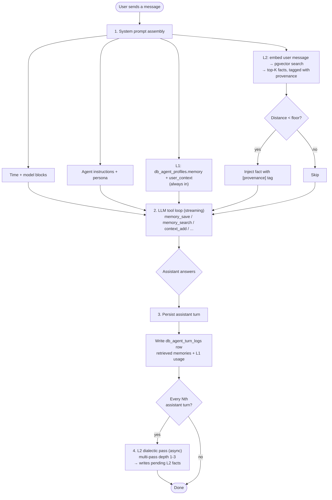

# Agent Memory

How the vault agent remembers things across conversations — the three layers,
how a turn uses them, how a fact earns trust, and how to read every number on the
Memory dashboard.

## 1. Overview

The agent has a layered, persistent memory so it gets to know the user over time
— their preferences, patterns, and ongoing work — instead of starting cold every
chat. It runs entirely on the existing stack (PostgreSQL + pgvector + Azure
OpenAI embeddings); no extra services.

## 2. The mental model

Memory comes in **three layers — L1, L2, L3** — split by *where it lives* and
*when it's used*:

| Layer | Role | Where it lives | In every prompt? |
|-------|------|----------------|------------------|
| **L1** | Always-in-context scratchpad | `db_agent_profiles.memory` / `.user_context` | **Yes** — injected verbatim |
| **L2** | Semantic long-term memory | `db_memory_entries` | Yes — top-K by relevance |
| **L3** | Conversation full-text search | `db_chat_messages` (FTS over transcript) | **No** — on-demand tool |

The thing to internalize is what happens *inside* **L2**. A fact there isn't
just "stored" — it carries two columns that decide how much it's trusted and
where it came from:

- **`status`** — `confirmed` (trusted, retrieved freely), `pending` (low-trust,
  surfaced only when strongly on-topic), or `rejected`.
- **`source`** — `user_stated`, `agent_observed`, `dialectic_derived`, `imported`.

Most `pending` facts are written by **L2's own dialectic pass** — a background
reasoner that reads recent chats and derives implicit facts as low-trust guesses.
Those guesses live in the **same table** as confirmed facts and graduate to
`confirmed` once corroborated or confirmed (see §5). There is no separate store
for guesses; they're just L2 facts that haven't earned trust yet.

## 3. How a single turn works

Everything below is a detail of this one flow. Read it top to bottom and the
layers click into place.

1. **Prompt assembly.** Time/model blocks, the agent's instructions + persona,
   then **L1** (both text fields, verbatim) and **L2** (the user's message is
   embedded and matched against stored facts; whatever clears the relevance
   floor is injected with a `[provenance]` tag).
2. **Tool loop.** The model streams its answer and may call memory tools along
   the way — `memory_*` (L2), `context_*` (L1), `search_conversations` (L3).
3. **Persist + log.** The assistant turn is saved, and a `db_agent_turn_logs`
   row records exactly which memories were retrieved (with scores) and how full
   L1 was — this is what the **Turn inspector** shows.
4. **Dialectic pass (async).** Every *N* assistant turns, L2's background
   dialectic reads the recent transcript and writes new `pending` facts. Fire-
   and-forget; it never blocks the reply.

> **Relevance floor** — a fact is only injected if it's close enough to the
> message (see §6). **Cadence** — the dialectic runs every *N* turns *within one
> conversation* (default 3), so short chats never trigger it.

## 4. The three layers, in depth

### L1 — always-in-context scratchpad

Two text columns on `db_agent_profiles`, both concatenated into the system prompt
on **every** turn:

- **`memory`** — the agent's own running notes (cap **2,200** chars).
- **`user_context`** — the user's standing profile / preferences (cap **1,375**).

Because it costs tokens on every single turn, it's hard-capped and reserved for
the handful of always-relevant essentials (identity, active projects, standing
preferences, hard constraints). The agent fills it via `context_add` and, when it
nears a cap, **consolidates** with `context_replace` rather than stopping — the
cap is the backpressure, not a wall. Anything that's only needed when a topic
comes up goes to L2 instead. Dedup here is normalized-string matching (it's free
text, not rows).

### L2 — semantic long-term memory

The agent's recall: a table of discrete, self-contained facts (e.g. *"User
prefers Rust for backend work"*). Each row carries a 1536-dim `embedding` (Azure
OpenAI `text-embedding-3-large`, HNSW cosine index) so facts are found by meaning,
not keywords. Each turn the user's message is matched against these embeddings
and the top-K relevant facts are injected, **confirmed ranked above pending**,
each tagged with its `[provenance]` so the agent treats guesses as claims to
verify. Trust and origin are tracked by `status` and `source` — see §5.

**How facts get into L2 — two ways:**

1. **Explicitly**, when the agent calls `memory_save` (from something the user
   said, or that it inferred during the chat).
2. **The dialectic pass** — L2's background reasoner. Every *N* assistant turns
   it reads the recent transcript and extracts implicit facts the user never said
   outright, running **multi-pass** (depth 1–3: raw observations → patterns →
   meta-patterns) and writing each as `source=dialectic_derived`,
   `status=pending`, `confidence=medium`. Cadence, depth, and model are per-agent
   config on `db_agent_profiles`. These are exactly the low-trust guesses that
   then live the lifecycle in §5 — they're L2 facts, just unconfirmed ones.

### L3 — conversation full-text search

L2 is lossy on purpose: it keeps *distilled* facts and discards the rest. L3
fills that gap by making the **verbatim transcript** keyword-searchable.

- **Write side (passive).** Every message also stores a plain-text `content_text`
  mirror; Postgres derives a `content_tsv` FTS vector automatically. No
  embeddings, no LLM, no added latency. Assistant prose is indexed too (thinking
  and tool-call blocks stripped, so only the actual answer is searchable).
- **Read side (on-demand).** Unlike L1/L2, L3 is **never auto-injected**. The
  agent calls `search_conversations` when the user references a past discussion
  ("what did we decide about X?"). Results are full-text-ranked, aggregated to
  the conversation level, and returned with a highlighted excerpt.

## 5. The life of an L2 fact

Every row in `db_memory_entries` carries three descriptors:

**`source`** — where it came from:
- `user_stated` — the user said it directly / asked to remember it (saved **high**).
- `agent_observed` — the agent inferred it in chat via `memory_save` (**medium**).
- `dialectic_derived` — produced by L2's dialectic pass; always starts `pending`, `medium`.
- `imported` — bulk-loaded from elsewhere.

**`status`** — trust + retrieval behaviour:
- `confirmed` — trusted; retrieved whenever relevant.
- `pending` — low-trust (usually a dialectic guess); retrieved only when *very*
  strongly relevant, and auto-expires after 60 days if never confirmed.
- `rejected` — discarded; kept for the record but never retrieved.

**`confidence`** (`high`/`medium`/`low`) — defaults from source, and bumps to
`high` when a pending fact is confirmed.

### How a pending fact graduates to confirmed

A `pending` guess becomes a trusted `confirmed` fact through any of three paths:

1. **Explicit confirmation** — the user clicks ✓ (or the agent calls
   `memory_confirm`).
2. **Corroboration** — the dialectic independently re-derives the same fact. When
   a new derivation lands within `CORROBORATE_DISTANCE` (**0.40** cosine) of an
   existing entry, a **Stage-B NLI** check judges the pair:
   - `entails` (same fact) → if the neighbour is **pending**, it's **promoted to
     confirmed**; if already confirmed, the new one is skipped as a duplicate.
   - `contradicts` → the new fact supersedes the old (`contradicts_id` set, old
     deactivated).
   - `neutral` (different but related) → both kept, linked via `related_ids`.

   *Why NLI and not just distance:* real re-derivations paraphrase heavily
   ("User is working toward X" vs "User prefers X") and land anywhere up to ~0.40
   — too far for the strict `DUP_DISTANCE` (0.15) used on direct saves. Cosine
   alone can't tell a reword from a sibling fact in that band, so NLI decides. If
   NLI is unavailable it falls back to cosine-only, trusting a match **only**
   below 0.15.
3. **Opportunistic ask** — when a pending fact clears the retrieval floor, the
   prompt nudges the agent to verify it conversationally ("I've had the
   impression you prefer X — is that right?").

**Expiry.** Pending entries carry `expires_at = created_at + 60 days`; a worker
sweep flips expired ones to `rejected`. Confirmed facts never expire.

## 6. The numbers, explained

Every figure on the dashboard is derived from one comparison — cosine distance —
so none of it is a mystery dial.

### Vocabulary

| Term | What it means |
|------|---------------|
| **Embedding** | A 1536-dim vector from `text-embedding-3-large`. Similar meanings land near each other. Every fact and chat message gets one. |
| **Cosine distance** (`<=>`) | How far apart two embeddings are. **`distance = 1 − similarity`** → **0 = identical**, ~**1 = unrelated**. Every metric below is built on this. |
| **Similarity %** | The friendly form: **`(1 − distance) × 100`**. Distance `0.20` → 80% similar. |
| **Nearest entry** | The other active, embedded memory with the smallest distance to a given fact — its closest neighbour in meaning. |
| **NLI verdict** | A one-word LLM judgment on a pair: `entails` (same fact), `contradicts`, `neutral`. Used where distance alone can't tell a reword from a sibling fact. |

### The four thresholds (all cosine distances — smaller = stricter)

| Constant | Value | Used in | Meaning |
|----------|-------|---------|---------|
| `DUP_DISTANCE` | **0.15** | `memory_save` dedup | This close = duplicate on save (no NLI — strict, no backstop). |
| `CORROBORATE_DISTANCE` | **0.40** | corroboration / dedup | A *candidate* for "same fact" → handed to NLI to decide. A loose pre-filter, not the verdict. |
| `FLOOR_CONFIRMED` | **0.65** | per-turn retrieval | A **confirmed** fact is injected only if `distance < 0.65`. |
| `FLOOR_PENDING` | **0.50** | per-turn retrieval | A **pending** fact uses the tighter `< 0.50` — guesses surface only when strongly on-topic. |

### Per-row corroboration metrics (the entry expander)

Expanding a row on the **Entries** tab calls `GET /agents/memory/entries/{id}/stats`,
computed against the entry's nearest active neighbour:

| Field | Formula / rule | Reading it |
|-------|----------------|------------|
| **distance** | `entry.embedding <=> nearest.embedding` | The "corroboration value" — how close this is to a fact already held. |
| **similarity %** | `(1 − distance) × 100` | Same thing, friendlier. |
| **corroborate band** | `distance < 0.40` | Inside = checked as the same fact; outside = treated as distinct. |
| **headroom %** | `(0.40 − distance) / 0.40 × 100` | **Positive** = how far *inside* the band; **negative** = how far *beyond* it. (`0.30` → `+25%`; `0.50` → `−25%`.) |
| **NLI verdict** | `nli_check(entry, nearest)` — only if in-band | `entails`/`contradicts`/`neutral`, or `n/a` when out-of-band. |
| **would promote on re-derive** | in-band **AND** `nli == entails` | Whether a fresh re-derivation would auto-promote it `pending → confirmed`. |

The track visual maps these onto a line from **0 (identical)** to **0.7
(unrelated)**: the shaded zone is `0 → 0.40` and the ◆ pin sits at the nearest
neighbour's distance.

### L1 capacity gauges

Pure character count against the hard caps:

- **`memory_pct` = `memory.chars / 2200 × 100`** (scratchpad).
- **`user_context_pct` = `user_context.chars / 1375 × 100`** (profile).
- **L1 card headline** = combined, since both are always injected:
  **`(memory.chars + user_context.chars) / (2200 + 1375) × 100`**.

### Retrieval & lifecycle numbers

- **top-K = 5** — at most 5 memories injected per turn, confirmed ranked first,
  after the floor filters by distance.
- **TTL = 60 days** — `expires_at = created_at + 60 days` for pending; the sweep
  rejects expired ones. Confirmed = `expires_at NULL` (never expires).

## 7. Reading the Memory dashboard

The `/admin/memory` page maps directly onto everything above.

- **Cards (top).** **L1** shows combined capacity (`scratchpad % · profile %`);
  **L2** the confirmed-fact count; **L3** indexed conversations/messages;
  **Pending** the count awaiting confirmation (L2 facts with `status=pending`);
  **∑** total active. Clicking a card filters the Entries tab to that slice.
- **Entries (L2).** The fact browser — filter by status/source/category/text.
  Expand a row (the ＋ toggle) for its **corroboration metrics** (§6) and a dump
  of every raw field. Row buttons confirm / reject / delete; the two collapsible
  legends explain the tags and the metrics.
- **Conversation search (L3).** Lists recent conversations by default; type to run
  the same full-text search the agent's `search_conversations` tool uses.
- **Turn inspector.** One row per completed turn — which memories were retrieved
  (expand for similarity %) and how full L1 was. This is the feedback loop for
  tuning the retrieval floors.

## 8. Reference

### Tables

- **`db_agent_profiles`** — one row per agent. `memory` + `user_context` are the
  **L1** fields; `instructions` is the system-prompt preamble; `dialectic_*`
  columns configure L2's dialectic pass (cadence / depth / model).
- **`db_memory_entries`** — **L2**. One row per fact: `content`,
  `embedding vector(1536)` (HNSW cosine), `source`, `status`, `confidence`,
  `category`, `tags[]`, `expires_at` (60-day TTL for pending), `contradicts_id` /
  `related_ids[]` (populated by Stage-B NLI), `is_active` (soft-delete).
- **`db_memory_embedding_jobs`** — embedding queue; the same `embedding-worker`
  that embeds notes drains it and writes vectors back.
- **`db_chat_messages`** — **L3** + pre-embed cache. Stores the transcript, a
  precomputed `embedding` (so L2 retrieval skips a synchronous embed), plus
  `content_text` + a `GENERATED content_tsv` with a partial GIN index for FTS.
- **`db_agent_turn_logs`** — observability behind the Turn inspector.

### Tools the agent uses

- **L1:** `context_add(text)`, `context_replace(old, new)`, `context_remove(text)`,
  `context_list` — hard caps (2,200 / 1,375), normalized-match dedup.
- **L2:** `memory_search(query)`,
  `memory_save(content, source?, category?, confidence?, tags?)`,
  `memory_update(id, content)`, `memory_delete(id)`, `memory_list(category?)`,
  `memory_confirm(id)`, `memory_reject(id)`, `memory_related(id)`.
- **L3:** `search_conversations(query, limit?)`.

### Embeddings

Saving a fact embeds it inline (so it's dedup-checked and searchable at once); if
the provider is down the row is inserted vectorless and a
`db_memory_embedding_jobs` row is queued for backfill. Same pipeline as notes:
Azure OpenAI `text-embedding-3-large`, 1536-dim, HNSW cosine.
